Para tener paginación utilizando Jekyll se asume que se tiene instalado **ruby.** Para verificar que está instalado se puede verificar desde la terminal tal y como aparece en la siguiente imagen:
[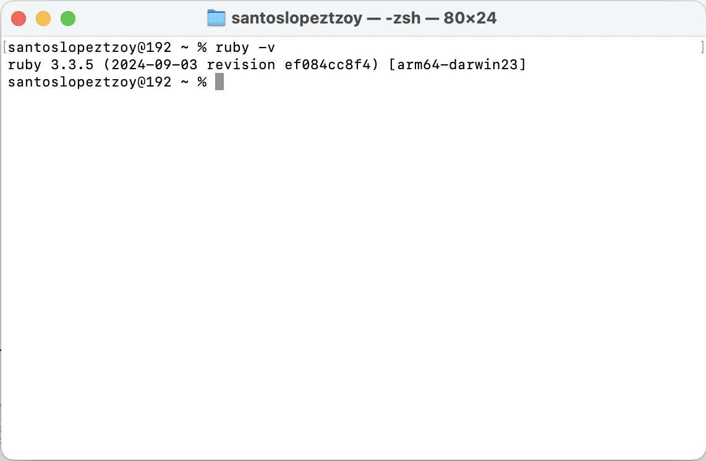](img/paginacion-jekyll/1.webp)

## Prerrequisitos de Jekyll
- Ruby version 2.5.0 o superior
- RubyGems
- GCC and Make

## Instalación de Jekyll y Ruby
Dependiendo el sistema operativo es conveniente leer el sitio oficial de: 
[https://jekyllrb.com/docs/installation/](https://jekyllrb.com/docs/installation/) para llevar a cabo la instación de Jekyll y Ruby.

### Creando proyecto en Jekyll
Para crear un nuevo proyecto se escribe el siguiente comando:
```
jekyll new example_pagination
```
[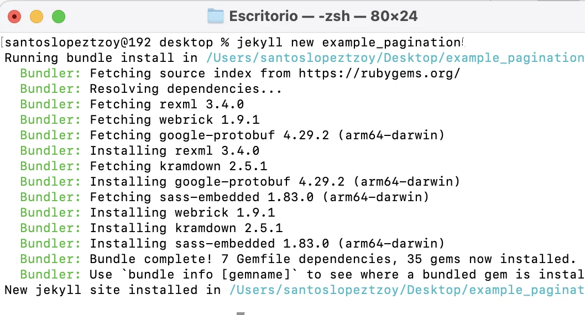](img/paginacion-jekyll/2.webp)

### Construir el sitio creado y hacerlo disponible en un servidor local
```
bundle exec jekyll serve
```
[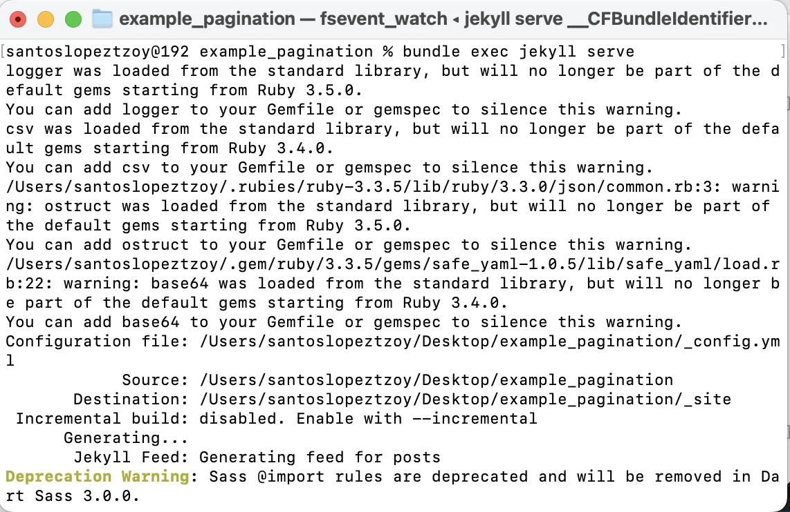](img/paginacion-jekyll/5.webp)
Algunos mensajes de errores los genera por defecto, no es relevante el error sin embargo se puede quitar agregando unas gemas en el archivo **Gemfile**.
Al correr el comando mencionado se puede acceder a [http://localhost:4000](http://localhost:4000) para ver el sitio web.

### Estructura del proyecto creado
- Carpeta: **_posts**
- Archivo: **config.yml**
- Archivo: **Gemfile**
- Carpeta: **_site** (es irrelevante se puede eliminar o ignorar la carpeta cuando se suba a github, etc)

La estructura del proyecto es la que aparece en la siguiente imagen: 
[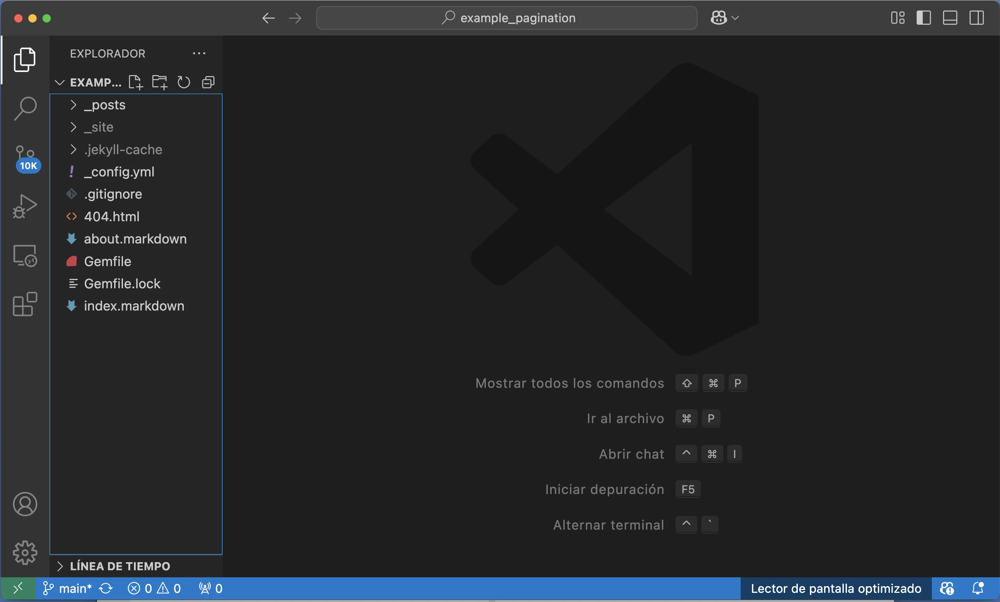](img/paginacion-jekyll/4.webp)


### Acceder al enlace generado
El sitio al que se debe acceder es: [http://localhost:4000](http://localhost:4000) luego de escribir el comando en la terminal.
```
    bundle exec jekyll serve
``` 

[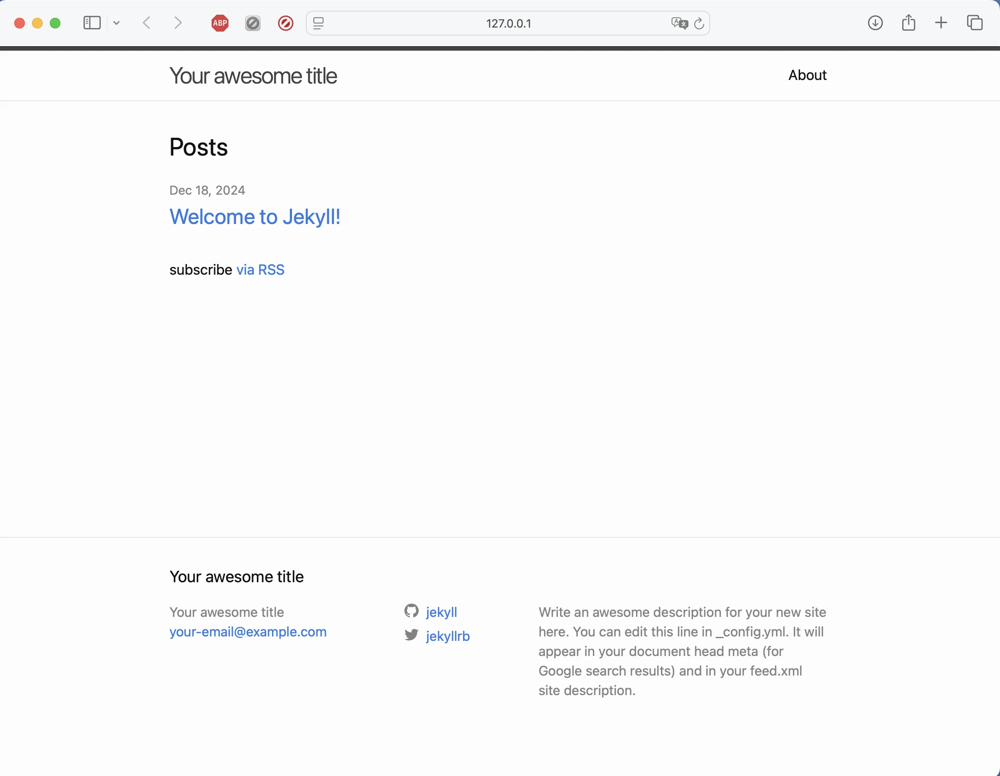](img/paginacion-jekyll/7.webp)

#### Modificar archivos necesarios para paginar
**Archivo _config.yml** 
Lo que aparece en amarillo fueron las líneas agregadas que son importantes para que sea posible paginar.
[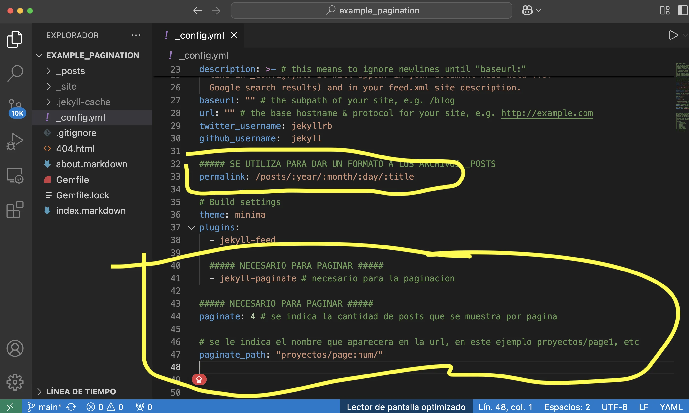](img/paginacion-jekyll/9.webp)

**Archivo Gemfile** 
Lo que aparece en amarillo fueron las gemas que se agregan para paginar. Sin embargo es necesario realizar otro paso para que se vuelva a generar el archivo **Gemfile.lock**
[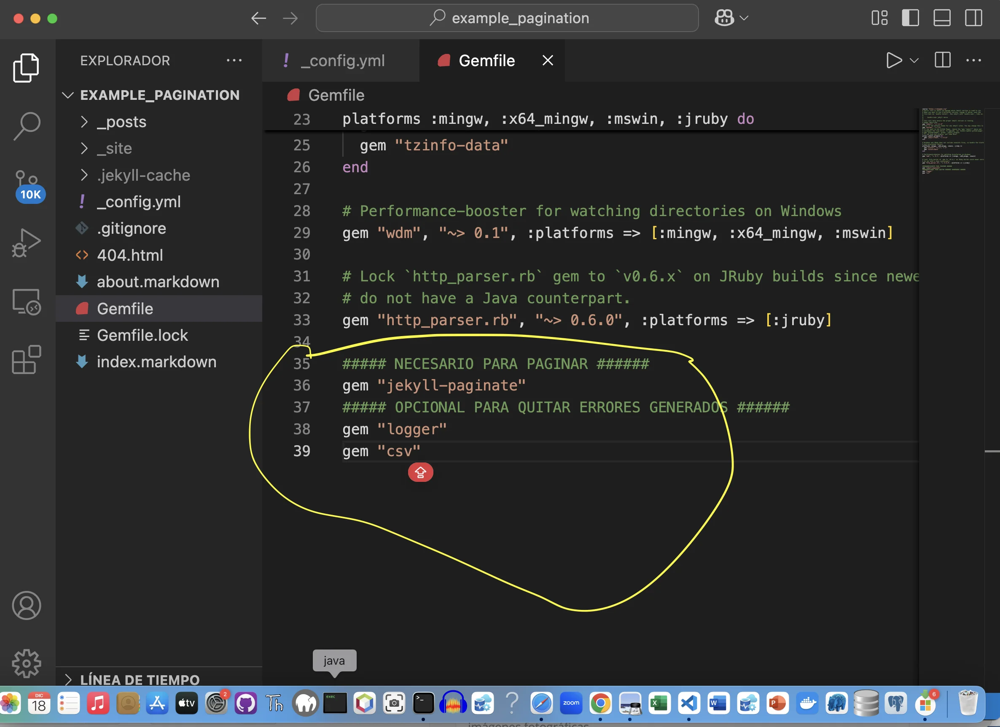](img/paginacion-jekyll/10.webp)

#### Correr comando bundle install
Para instalar las gemas agregados en el archivo **Gemfile** escribir:
```
    bundle install
```
[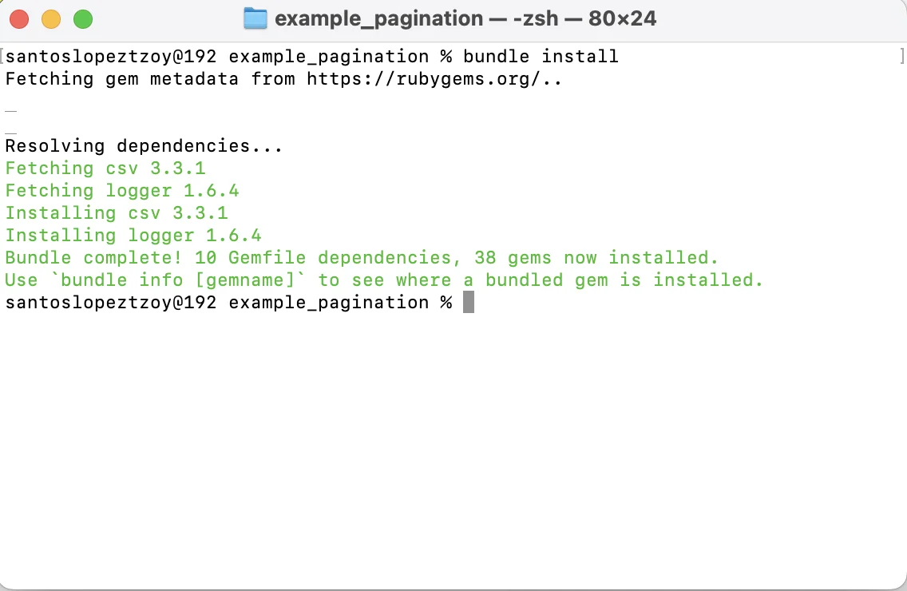](img/paginacion-jekyll/11.webp)
Básicamente cuando se escribe el comando se obtiene el resultado similar al que aparece en la imagen.

#### Documentación oficial para la paginación
[https://jekyllrb.com/docs/pagination/](https://jekyllrb.com/docs/pagination/)
En el sitio oficial detalla más las opciones disponibles, sin embargo para la paginación ya se realizo en los pasos anteriores (en la imagen donde aparece subrayado en amarillo). Sin embargo dependiendo la versión que se este utilizando de Jekyll es probable que pueda sufrir ciertas actualizaciones con el tiempo.

#### <code>IMPORTANTE: la paginación solo funciona en archivo index.html</code>
[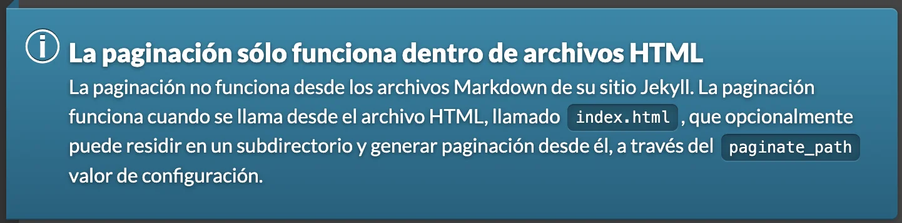](img/paginacion-jekyll/12.webp)
Se probo con otros nombres de archivos sin embargo no funciono, hasta que en la documentación oficial resalta que **la paginación solamente funciona en el archivo index.html**

#### Modificar layout default de Jekyll
Por defecto Jekyll al correr el comando **jekyll new nameProject** no genera las carpetas de **_layout, _includes, etc** sin embargo genera por defecto un tema que está llamando al **layout: home** pero al revisar la carpeta generado por Jekyll no aparece. 
Para más información revisar el siguiente enlace:
[https://jekyllrb.com/docs/themes/#overriding-theme-defaults](https://jekyllrb.com/docs/themes/#overriding-theme-defaults)

#### <code>Archivo index.markdown renombrarlo a index.html y eliminar layout por defecto del archivo</code>
Debido a que la paginación solo funciona en el archivo llamado index.html se renombro el archivo index.markdown a la extensión html.
[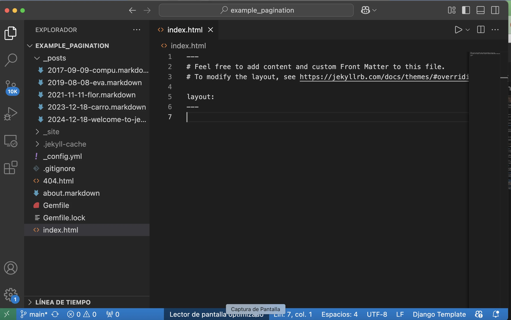](img/paginacion-jekyll/13.webp)
Básicamente el código que queda en el archivo index.html es como el que aparece en la imagen anterior.

**Observar en la imagen que el texto layout: home fue eliminado**

#### Visualizar la página actual en el browser
Al visualizar el proyecto en [http://localhost:4000](http://localhost:4000) se observa que no tiene nada de contenido, es un sitio web completamente vacío.
[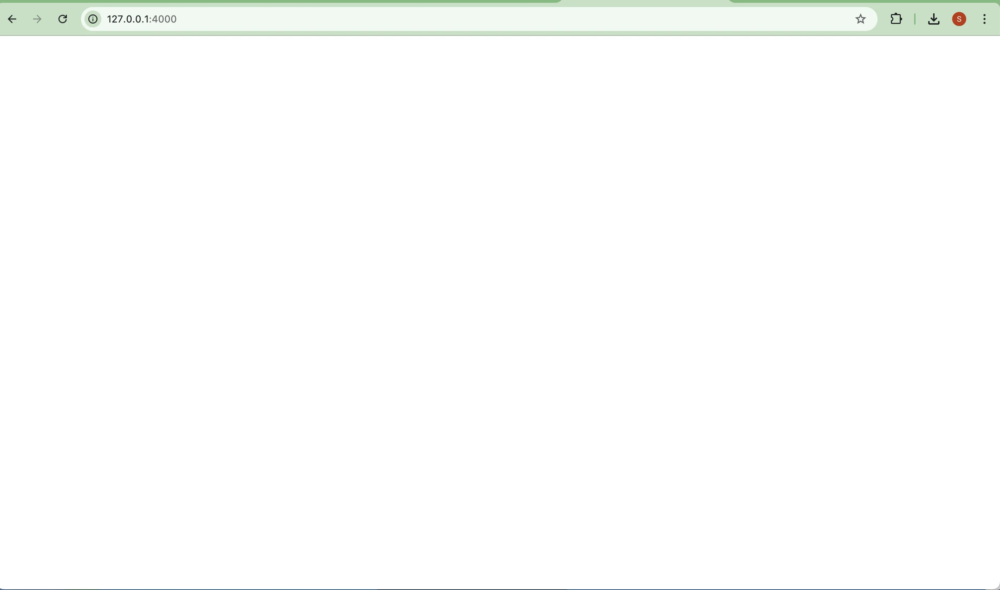](img/paginacion-jekyll/14.webp)

#### <code>Agregar código necesario para paginar en archivo index.html</code>
**El último paso es indicarle que muestre lo que hay en la carpeta _posts**
El código agregado corresponde al que aparece en la documentación oficial: [https://jekyllrb.com/docs/pagination/](https://jekyllrb.com/docs/pagination/)
[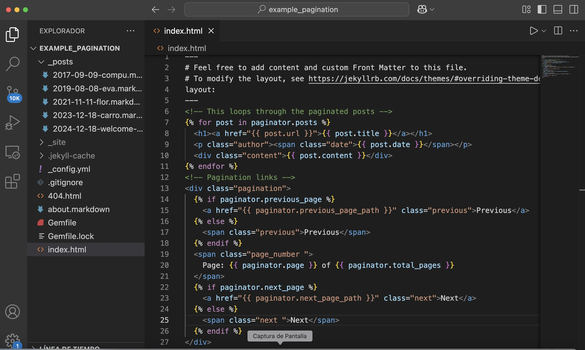](img/paginacion-jekyll/15.webp)

#### <code>Finalmente la paginación ya está completado</code>
[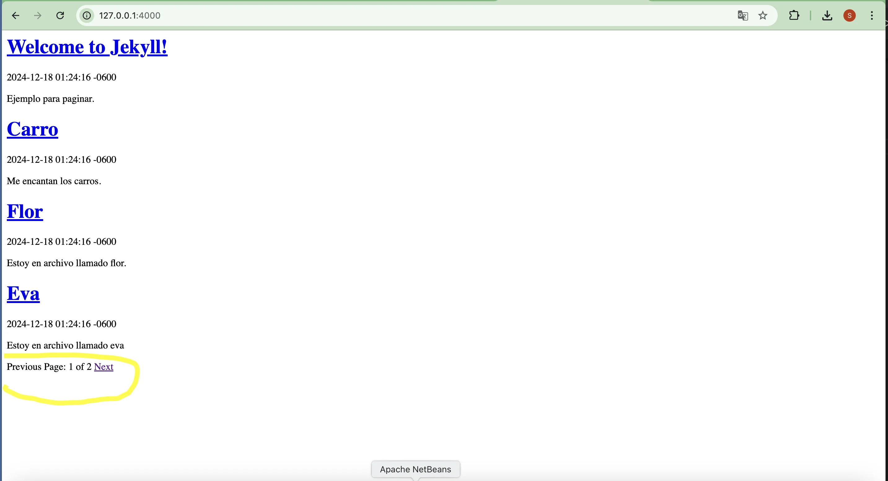](img/paginacion-jekyll/16.webp)
**Debido a que en el archivo _config.yml se puso por defecto paginate: 4** en la imagen aparece en la primera página 4 resultados, cuando hay más de 4 archivos en _posts se crea la opción de siguiente página tal y como aparece en la imagen.

**Observar que aparece la opción de regresar a la página anterior**
[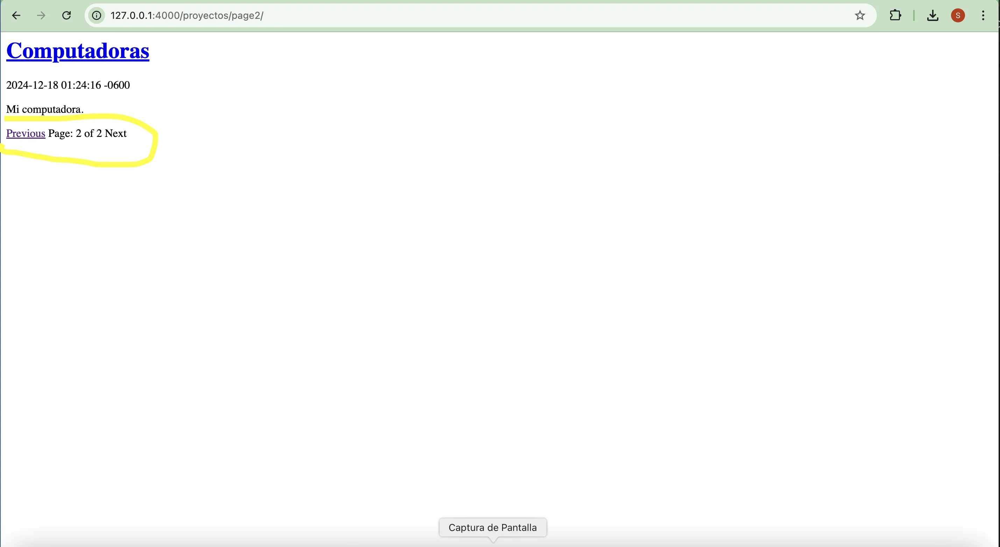](img/paginacion-jekyll/17.webp)