## **Proyecto con Raspberry Pi Pico con comunicación serial UART y aplicación web**
El proyecto tiene como objetivo establecer la comunicación entre dos Raspberry Pi Pico mediante el uso del servidor web Python Flask para el envío y recepción de mensajes. La comunicación se logra a través del protocolo serial UART. Se ha definido un formato específico para el envío y recepción de mensajes, permitiendo que ambas Raspberry Pi Pico determinen cuándo se envió el primer mensaje y cuándo la conexión se ha establecido con el otro microcontrolador.

<!--more-->
El proyecto se desarrollo en Micropython en el microcontrolador (Raspberry Pi Pico) y el servidor web en Python Flask para el envío y recepción de mensajes. Para el almacenamiento de todos los mensajes se utilizo la base de datos Sqlite. 

### <code>Materiales necesarios</code>
### Listado de materiales
Raspberry Pi Pico, protoboard, cables para las conexiones de los microcontroladores, módulo convertidor USB a serial TTL (necesario para lograr la comunicación entre el servidor web y la Raspberry Pi Pico), cable USB macho A a micro-USB macho (para conectar la Raspberry a la computadora)

[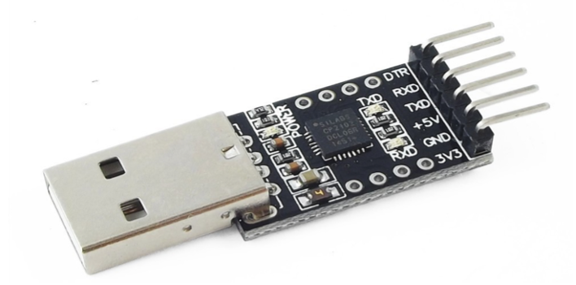](img/rpp-flask/convertidor-usb-serial-ttl.webp)

[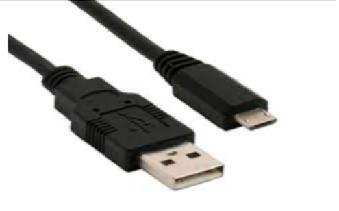](img/rpp-flask/cable-usb-macho-micro-usb-macho.webp)

#### Pines de la Raspberry Pi Pico
[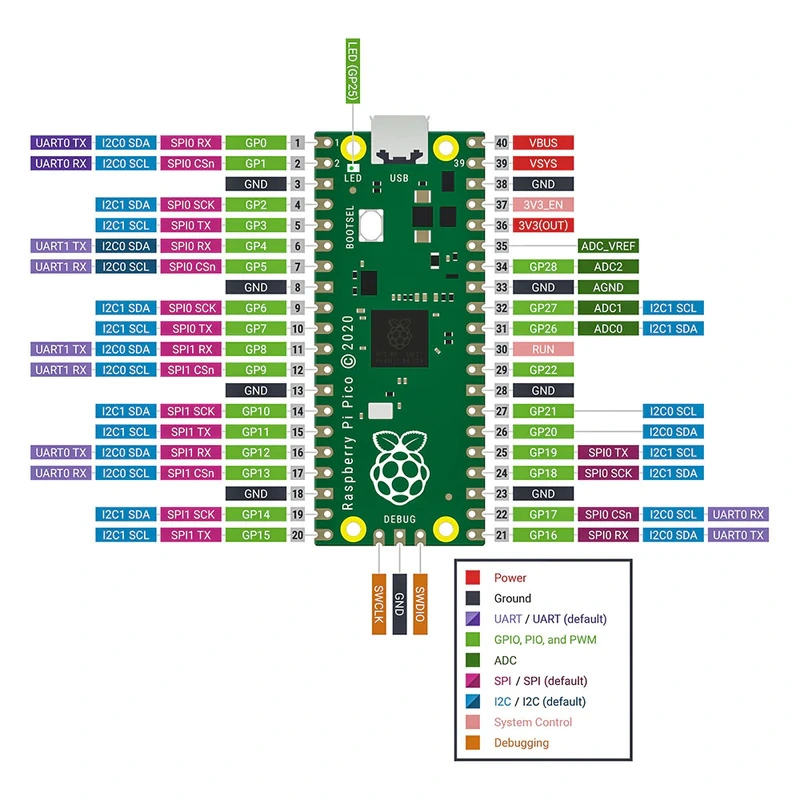](img/rpp-flask/raspberry-pi-pico-diagrama.webp)

#### Diagrama para la conexión de las Raspberrys y los cables.
En la imagen se observa que el cable convertidor USB a serial TTL está conectado al primer UART (0) del microcontrolador. En el segundo UART (1) se está utilizando para conectar ambas Raspberrys Pi Pico. Básicamente lo que se consigue en este diagrama es que ambas Raspberry Pi Pico puedan enviar y recibir mensajes entre ellos. 
[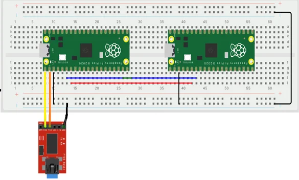](img/rpp-flask/diagrama-protoboard-raspberrys-uart.webp)

<code>¿Cuántos UART tiene la Raspberry?</code>
El microcontrolador cuenta con 2 UART. El Uart 0 y el Uart 1. Debido a que el proyecto el objetivo es conectar 2 Raspberrys en serial UART, y realizar el intercambio de mensajes desde una aplicación (formulario, html) utilizando Java, Python Flask, C, etc. Hay un Uart (0) que se utilizo para conectar el cable convertidor USB a serial TT hacia el microcontrolador, por lo tanto el otro Uart (1) solo queda disponible para conectar las 2 raspberrys. 

#### Conexión entre todos los componentes
La siguiente imagen ilustra como se mira la conexión entre los componentes (Raspberrys, cables, protoboard, etc).
[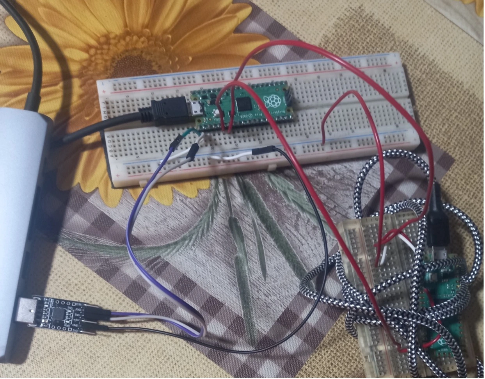](img/rpp-flask/conexiones-raspberrys.webp)

<code>¿Cómo van conectados las Raspberrys y el cable convertidor usb serial a TTL?</code>
La siguiente tabla ilustra como se deben conectar estos componentes. Ejemplo: para conectar ambas Raspberry es necesario que los cables de las conexiones vayan contrarias unas a otras, de la Raspberry Pi Pico 1 sale un cable desde RXD que va hacia el TDX de la Raspberry Pi Pico 2. Y desde la Raspberry Pi Pico 1 sale un cable desde TXD que va hacia el RXD de la Raspberry Pi Pico 2. Se realiza el mismo procedimmiento para conectar una raspberry con el cable convertidor usb serial TTL. 

| Rasppberry 1 | Raspberry 2|
| -------------|----------- |
| RXD          | TDX        |
| TXD          | RXD        |

#### <code>¿Qué necesito para que desde el servidor web pueda enviar y recibir mensajes y que aparezca en la Raspberry Pi Pico (Thonny IDE, etc)? | Abrir puerto en el lenguaje de programación que se este utilizando</code>
Es necesario habilitar el puerto serial. Dependiendo el sistema operativo que se este utilizando es posible que la ruta del puerto cambie, recomendable listar los puertos COM (serial) que es la que nos va permitir que la Raspberry Pi Pico y Flask Python (página web) se puedan comunicar. Independientemente del lenguaje de programación se debe buscar como habilitar el puerto, ejemplo: si fuera el caso en C, va ser lo mismo, habilitar el puerto serial. 
- [Ejemplo habilitar puerto en Python:](https://github.com/santoslopez/RaspberryPiPico-Gui-Serial-Uart/blob/main/servidor/puertoSerial.py
)

#### <code>Documentación de Raspberry Pi Pico de microcontrolador</code>
- [Sitio oficial para microntrolador en C:](https://www.raspberrypi.com/documentation/microcontrollers/c_sdk.html
)
- [Sitio oficial para microntrolador en Micropython:](https://www.raspberrypi.com/documentation/microcontrollers/micropython.html
)

#### <code>Iniciar sesión</code>
Al correr el programa en python flask la primera pantalla que aparece es la de iniciar sesión o registrar una cuenta de usuario. Básicamente 
[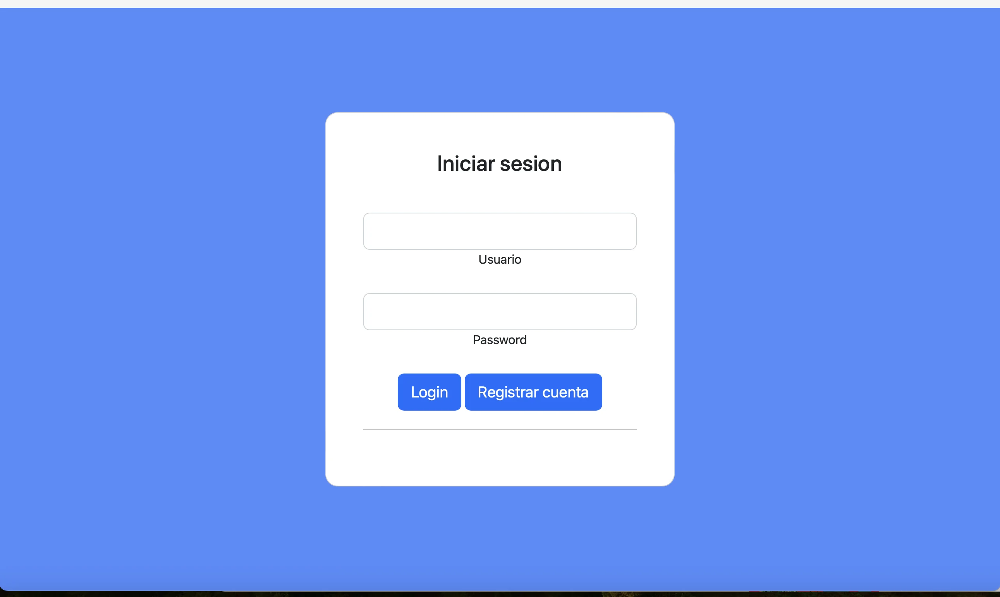](img/rpp-flask/1.webp)

#### <code>Listado de Raspberry Pi Picos</code>
Es importante registrar el nombre que tiene la Raspberry Pi Pico, básicamente este nombre de usuario que otros Raspberry Pi Pico se han puesto es una forma de identificar a quién enviarle el mensaje. Sino se coloca el nombre que es, el programa válida que este nombre exista (raspberry pi pico vecino) y por lo tanto no se le envía el mensaje en caso que no hay una tarjeta con este nombre. Al registrar el nombre de la Raspberry Pi Pico vecino se hace desde la parte del servidor en python Flask. 
[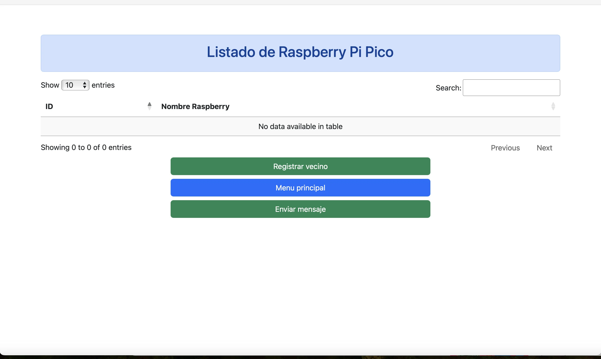](img/rpp-flask/2.webp)
En la imagen anterior debido a que no hay Raspberry Pi pico registrados se muestra la tabla en blanco.

*En caso que hay Raspberry Pi Pico registrados* se muestra el listado:
[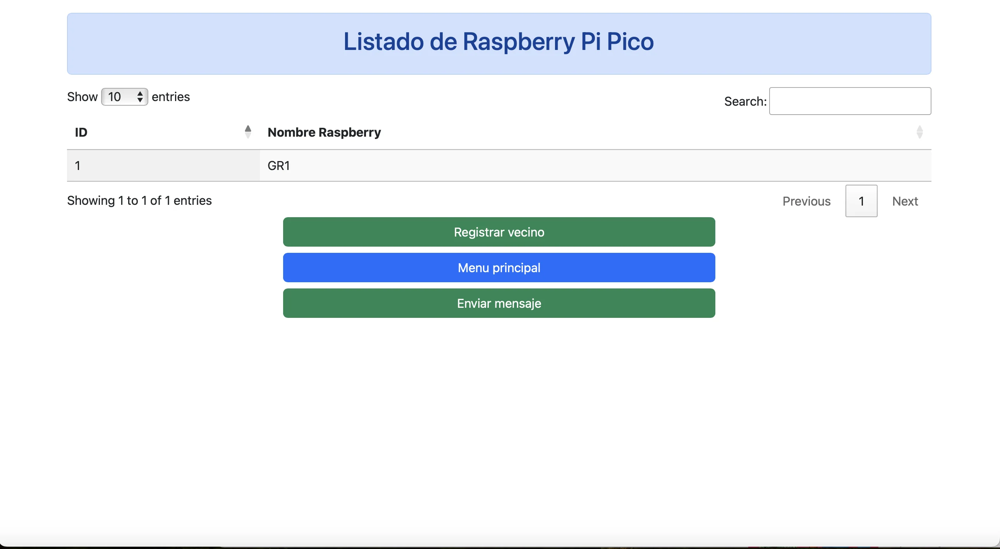](img/rpp-flask/7.webp)

#### <code>Enviar mensaje desde mi Raspeberry Pi Pico a otras Raspberry Pi Pico (no están conectadas o no existen)</code>
En caso que no se hayan registrado todavía el nombre que tiene otras Raspberry Pi Pico (de otras personas) y se desee enviar un mensaje desde la Raspberry Pi Pico (en la que estoy) en python flask se muestra un mensaje de error y no se procede a enviar el mensaje debido a que no hay con quién hacer el intercambio de mensajes. 
[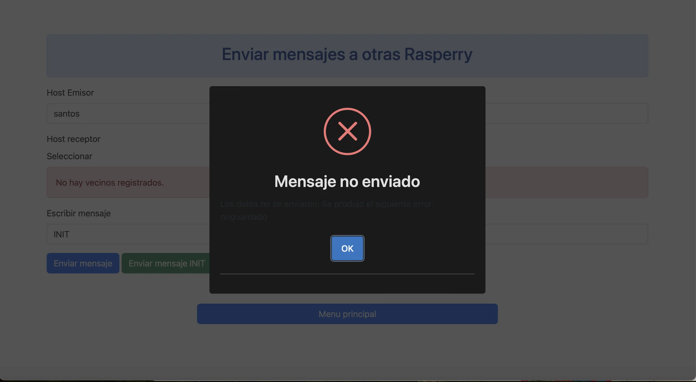](img/rpp-flask/6.webp)

#### <code>Enviando mensaje a otras Raspberry Pi Pico conectadas</code>
Si el mensaje es válido esto quiere decir que el nombre del Rasperry Pi Pico que se coloco como emisor existe o está conectado con la tarjeta que hace el envío del mensaje se procede a realizar el intercambio de mensajes. Importante resaltar que el host emisor es el que está enviando el mensaje y el receptor es quién recibe el mensaje.
[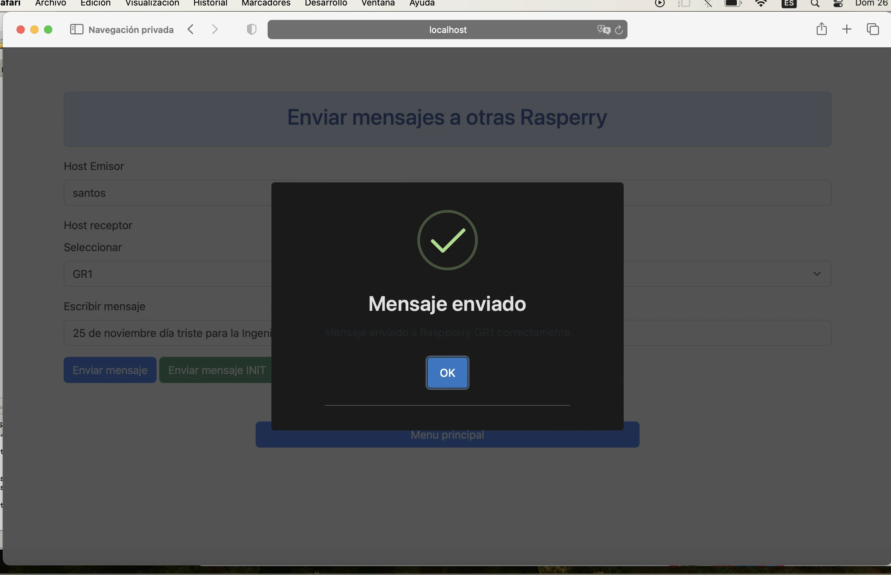](img/rpp-flask/4.webp)

#### <code>Mostrar mensaje enviado desde servidor python flask usando la Raspberry Pi Pico y desplegarlo en Thonny, Python IDE for beginners</code>
[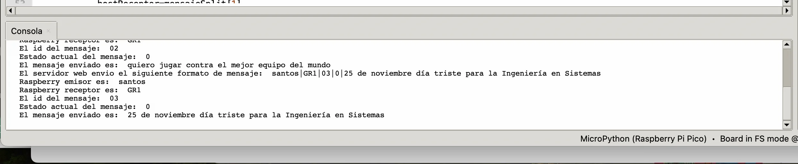](img/rpp-flask/14.webp)

#### <code>Registrar nombre de Raspberry Pi Pico con la que se desea conectar</code>
Para que pueda procederse a realizar el intercambio de mensajes entre las Raspberry Pi Pico se debe conerse el nombre con el que se identifica, por lo tanto se registra el nombre de usuario de cada Raspberry con la que se desea realizar el intercambio de mensajes.
[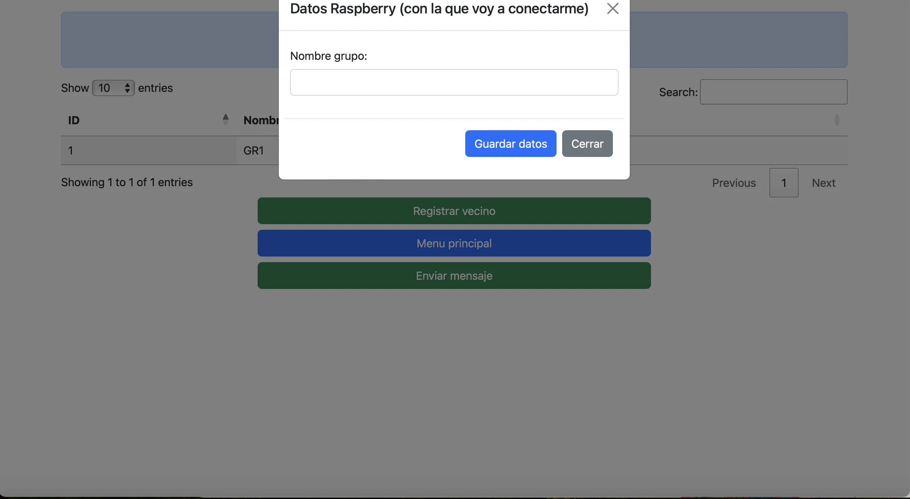](img/rpp-flask/8.webp)

#### <code>¿Cómo identificar que el mensaje se envio?</code>
Entre las Raspberry Pi Pico hay un convenio, el cuál es *mostrar el mensaje INIT* que esto quiere decir que es quién empezo con el envío del mensaje. Básicamente se verifica que el mensaje que se recibe sea un INIT si es así entonces la otra Raspberry Pi Pico procede a responder con un mensaje. 
[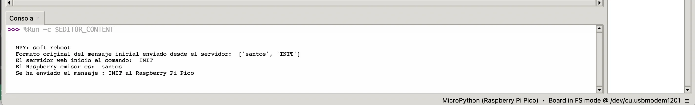](img/rpp-flask/10.webp)

#### <code>¿Qué IDE utilizar para programar en MicroPython?</code>
Para programar en la tarjeta de Raspberry Pi Pico se utilizo [Thonny Ide MicroPython](https://thonny.org) sin embargo es posible encontrar otras que puedan ser de su preferencia.

