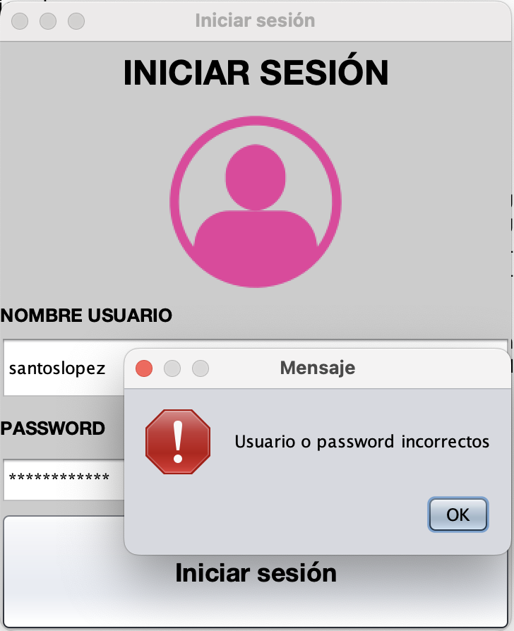
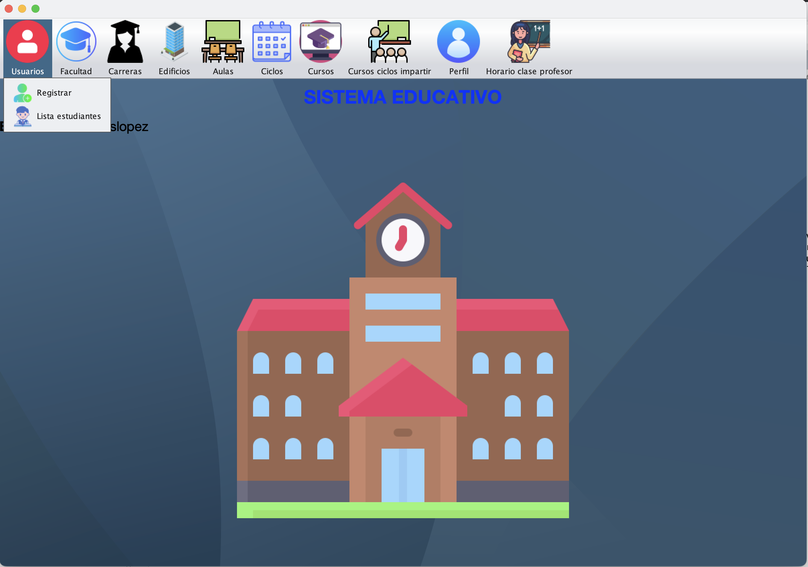
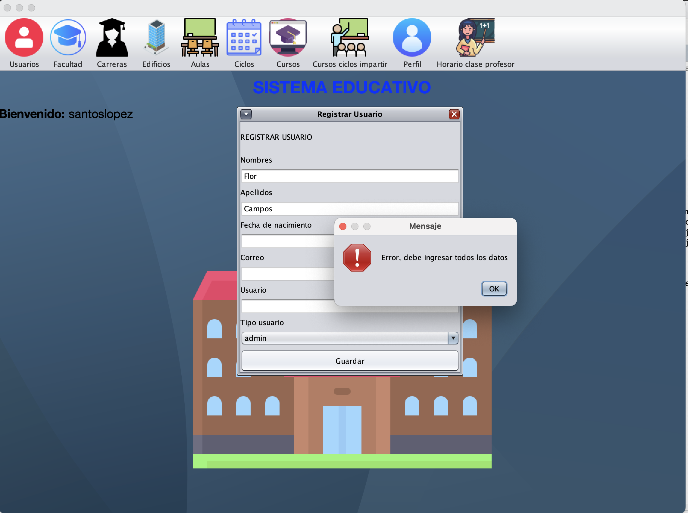
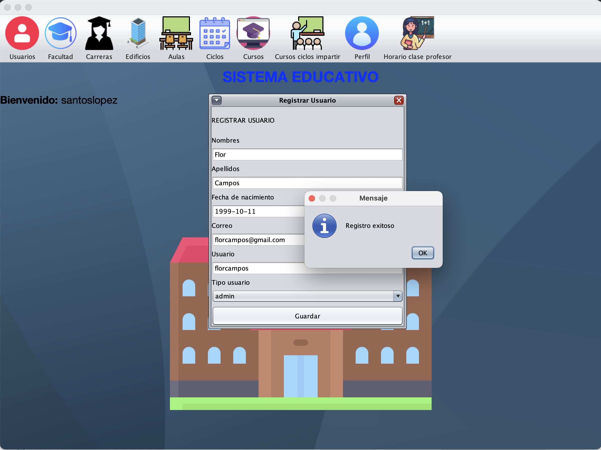
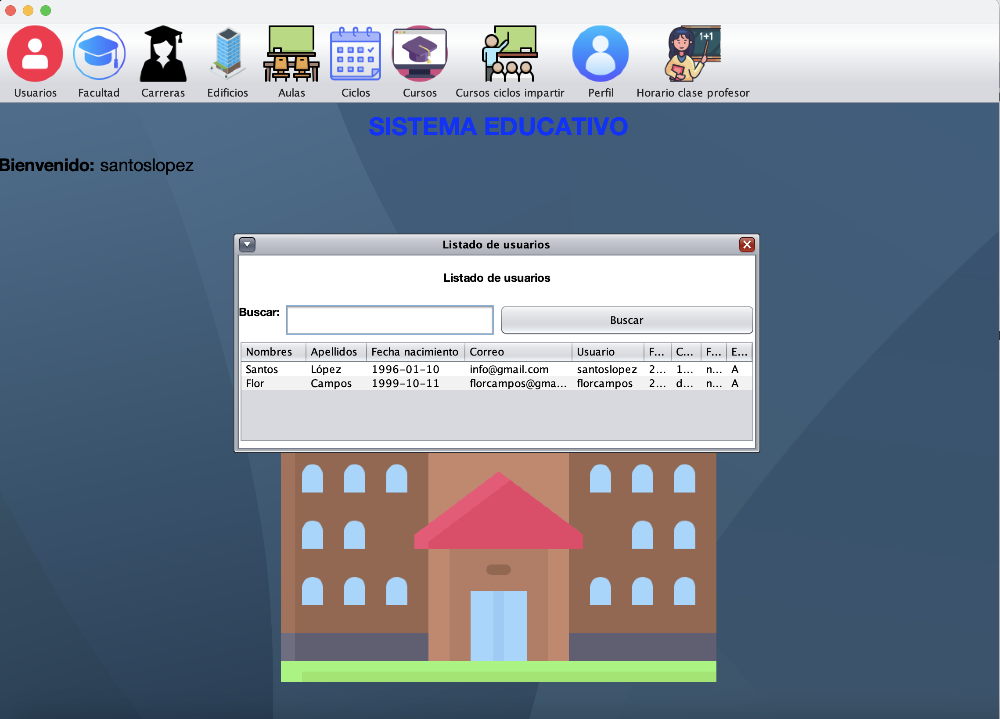
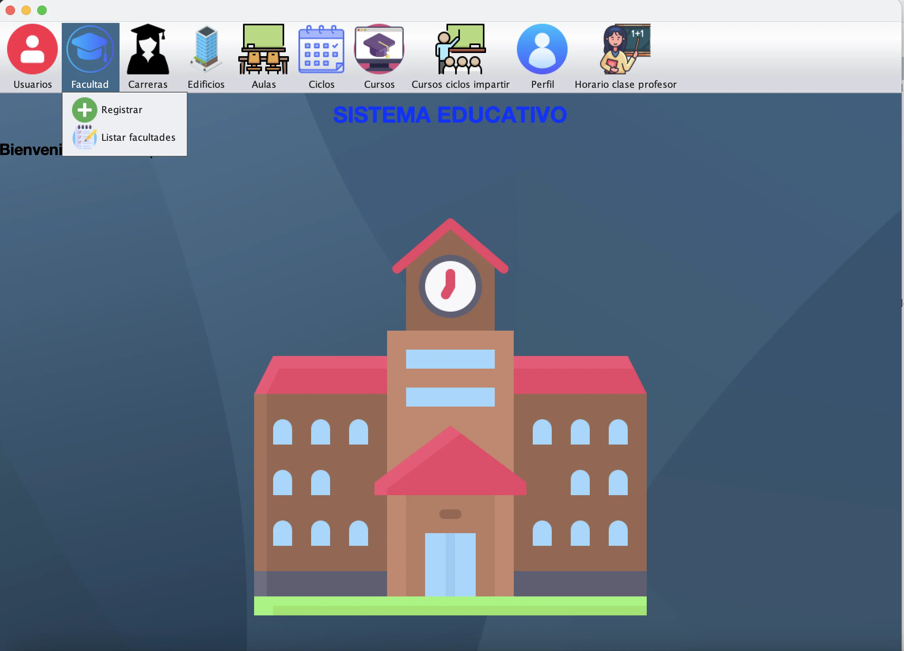
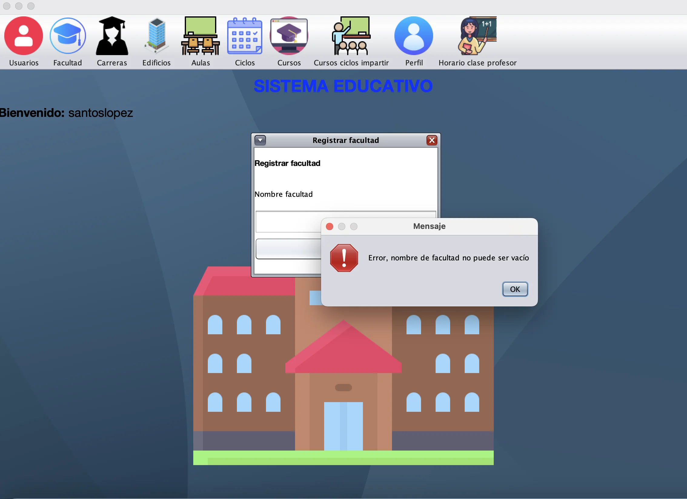

## **Software para asignación horarios de estudiantes y profesores en universidades o colegios, etc.**
El software se hizo para mejorar las habilidades de programación orientada a objetos y reforzar los conocientos en MySQL.
<!--more-->
Básicamente el sistema tiene varias funcionalides como: agregar, modificar, eliminar y listar. Dependiendo del tipo de rol del sistema pueden tener restricciones los usuarios, ejemplo: el rol administrador es el encargado de asignar a los profesores a los respectivos cursos que deben impartir, etc. 

## Inicio de sesión
Si el usuario o password son incorrectos el sistema indica el error.

### Modalidad administrador
La pantalla principal del sistema de la modalidad administrador es la que aparece en la siguiente imagen.
<code>Pantalla principal</code>

#### Usuarios
En la opción de usuarios se puede registrar, listar los usuarios registrados y modificar sus datos.

**Validar registro de usuarios**

**Registro exitoso de usuarios (profesores, estudiantes)**

**Listado de usuarios**

#### Facultad

Se realizan todas las validaciones adecuadas como **verificar que el nombre no exista** o que los datos no sean vacíos.

    <a href="https://github.com/santoslopez/sistema-gestion-academica" class="enlacesSkills" title="Perfil de GitHub">
    Código en GitHub
    </a>

